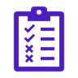
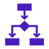

# AISaE by Design: Developer Handbook

*A practical approach to building beneficial AI*

## What This Is

AISaE by Design is a framework that helps you, the developer, build AI systems that benefit people by providing you with the tools and information you need to make sound design decisions. It's not about perfect ethics or endless processes, it's about being intentional and managing the things that matter. At its heart the framework is about providing you with clearer, less ambiguous information on the values and concerns that matter to users.

**Focus:** Connect what your community values to what you actually build.

## Why Use This

**You get:**
- Clearer understanding of what your users and society actually care about
- Practical risk management that fits your project
- Optimised features that align to values, not just functionality
- Documentation that demonstrates you've thought things through
- A process that scales with your project size and where you choose the level of involvement

**You avoid:**
- Building something people don't trust or want
- Nasty surprises after launch
- Reputation damage from preventable issues
- Generic AI Ethics statements that don't help shape the system

---

## The Process: 9 Steps

You can start using the framework at any point in your project, but earlier is easier so you can start out development with the context in mind. Here's how you get started with the framework

###  1. **Classify Your Project** (30 minutes)
**What:** Classify your project by purpose, environment, control, and capability  
**You get:** Clear project category and relevant guidance, registration onto the framework
**Template:** Project Details Template 

###  2. **Ask the AISaE Developer Companion** (1-2 hours)
**What:** LLM-powered tool provides tailored suggestions for values, principles, and risks based on your project classification  
**You get:** AI-generated starting point grounded in patterns and research  
**Output:** Suggested values, potential risks, opportunities specific to your project type 

###  3. **Sense-Making Sessions** (1-3 hours, if desired)
**What:** Inclusive workshops to review, refine, and prioritise the AI-generated suggestions with stakeholders  
**You get:** Community-validated and contextualised guidance  
**Output:** Stakeholder-refined values, risks, and opportunities 

###  4. **Session Capture** (30 minutes)
**What:** Record sense-making session outputs in structured format  
**You get:** "Don't forget" document combining AI insights with stakeholder input  
**Template:** Session Output Capture 

###  5. **Choose Your Approach** (1 hour)
**What:** Decide how much effort to put in 
**You get:** Realistic scope for your situation  
**Options:** 5-10% / 10-15% / 15-20% of development time 

###  6. **Prioritise Everything** (2 hours)
**What:** Developer team decides Must/Should/Could/Won't for values, risks and opportunities based on capacity and vision 
**You get:** Clear priorities for implementation  
**Template:** Implementation Approach Selection 

###  7. **Prep for Use**
**Risk Management:** *Set Risk Thresholds (2 hours) → Fill Risk Register (1 hour)
**Feature Development:** *Feature Design (4-8 hours) → Build with Intent*

 

---

## What You End Up With

### **Documents**
- Project classification and context
- Stakeholder values and priorities captured
- Risk register with clear ownership and actions
- Feature specifications linked to real user needs
- Monitoring plan for ongoing success

### **Capabilities**
- Clear decision-making process for value trade-offs
- Risk management to pre-empt and avoid issues
- Features that users want and trust
- Defensible choices that will be visible through the framework

### **Outcomes**
- An AI system that benefits the people it affects
- Reduced risk of harmful unintended consequences  
- Better user adoption and satisfaction
- Stronger reputation and stakeholder relationships
- Potential compliance evidence for regulations

---

## Effort by Approach

Developers select the level of effort they can commit.

### **Approach 1: Keep It Simple** (5-10% of dev time)
- Focus on critical Must-Do items only
- Basic risk management and monitoring
- Team-driven decisions
- **Good for:** Solo developers, contained experiments, low-risk projects

### **Approach 2: Do It Properly** (10-15% of dev time)
- Comprehensive Must-Do and Should-Do implementation
- Active stakeholder involvement
- Regular monitoring and adjustment
- **Good for:** Commercial projects, social-facing systems

### **Approach 3: Set the Standard** (15-20% of dev time)
- Full implementation including Could-Do items
- Community engagement and transparency
- Comprehensive monitoring and sharing learnings
- **Good for:** High-stakes projects, industry leadership

---

## Quick Start Guide

**For experienced teams who want to dive in:**

1. **Classify your project** → Project Details Template
2. **Get AI suggestions** → AISaE Developer Companion
3. **Run sense-making sessions** → Session Output Capture  
4. **Choose approach and prioritise** → Implementation Approach Selection
5. **Set up risk management** → Risk Register + Risk Threshold Setting
6. **Design features** → Feature Design Template
7. **Build and monitor** → In-Life Monitoring Plan

**Time to first valuable output:** 1-2 days  
**Time to full implementation:** 2-6 weeks depending on approach

---

## Getting Help

**Community resources:**
- Pattern library for common project types
- Example implementations and case studies
- Templates and worksheets for all stages

**When you need support:**
- Complex stakeholder situations
- Novel risk scenarios
- Technical implementation challenges
