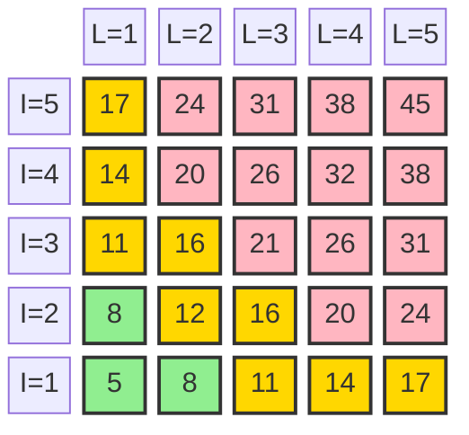
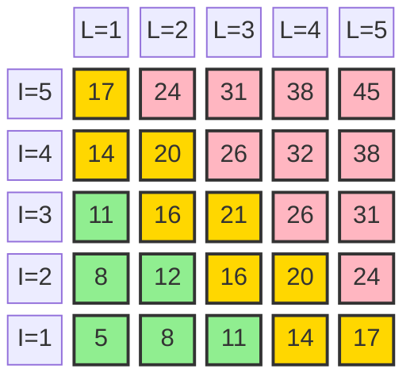
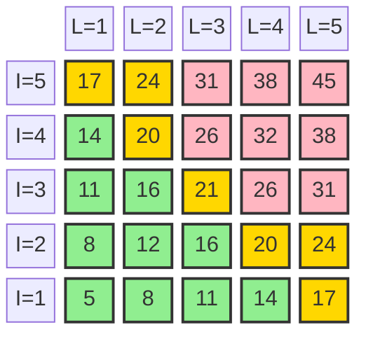

# Risk Threshold Setting Worksheet

*Setting your acceptable risk levels*

```yaml
project_info:
  project_id=""
```

## What This Is About

You need to decide what level of risk you're comfortable with. This isn't about eliminating all risk (impossible), it's about being clear on what's acceptable vs. what requires action.

**Input:** Your risks from the Risk Register spreadsheet
**Output:** Clear thresholds for Green/Yellow/Red zones that you'll use to score each risk

## Risk Scoring Formula

**Risk Score = 2×(Impact + Likelihood) + (Impact × Likelihood)**

*This formula gives appropriate weight to both additive and multiplicative effects of impact and likelihood.*

**Score Range:** 5 to 45

## Step 1: Choose Your Base Risk Appetite

Pick the threshold pattern that best fits your project's risk tolerance:

### Option A: Conservative
*"Better safe than sorry"*
- **Green Zone:** 5-9 (Monitor only)
- **Yellow Zone:** 10-18 (Take action to reduce)
- **Red Zone:** 19-45 (Must fix before proceeding)



**Good for:** High-stakes projects, safety-critical systems, first-time builders

### Option B: Moderate  
*"Balanced approach"*
- **Green Zone:** 5-12 (Monitor only)
- **Yellow Zone:** 13-21 (Take action to reduce)
- **Red Zone:** 22-45 (Must fix before proceeding)



**Good for:** Most commercial projects with experienced teams

### Option C: Risk-Tolerant
*"Move fast, manage actively"*
- **Green Zone:** 5-16 (Monitor only)
- **Yellow Zone:** 17-25 (Take action to reduce)
- **Red Zone:** 26-45 (Must fix before proceeding)



**Good for:** Low-stakes applications

### Option D: Custom
*"I'll set my own thresholds"*
- **Green Zone:** 5-_____ (Monitor only)
- **Yellow Zone:** _____-_____ (Take action to reduce)
- **Red Zone:** _____-45 (Must fix before proceeding)

### Your Choice

<!--%THRESHOLD_OPTION-->
**I choose Option:** 
- [ ] A (Conservative)
- [ ] B (Moderate)
- [ ] C (Risk-Tolerant)
- [ ] D (Custom)

**(If choosing D)
My base thresholds are:**
- **Green Zone:** 5-_____
- **Yellow Zone:** _____-_____
- **Red Zone:** _____-45

---

## Step 2: [Optional] Adjust Risk Familiarity Adjustments

How well you understand a risk affects how cautious you should be. You can choose to scale a risk score if you are less familiar with that risk's behaviour

### Familiarity Scaling

| Risk Familiarity                                             | Multiplier | Reasoning            |
| ------------------------------------------------------------ | ---------- | -------------------- |
| **Known** (seen this before, documented solutions)           | **× 1.0**  | No adjustment needed |
| **Foreseeable** (understand theoretically, limited examples) | **× 1.2**  | Be 20% more cautious |
| **Emergent** (novel, unclear boundaries)                     | **× 1.4**  | Be 40% more cautious |

<!--%FAMILIARITY_SCALING-->
**Apply scaling?**
- [ ] Yes (above values will be used)
- [ ] No (no change)

---

## Step 3: [Optional] Apply Development Stage Adjustments

Your risk tolerance should get stricter as you get closer to real users:

### Stage Scaling

| Development Stage | Multiplier | Reasoning                                 |
| ----------------- | ---------- | ----------------------------------------- |
| **Concept**       | **× 0.7**  | Higher risk acceptable, no real users yet |
| **Prototype**     | **× 0.8**  | Slightly more cautious, proving concept   |
| **Development**   | **× 0.9**  | More cautious, building for real use      |
| **Operations**    | **× 1.0**  | Most cautious, real users affected        |

<!--%STAGE_SCALING-->
**Apply scaling?**
- [ ] Yes (above values will be used)
- [ ] No (no change)
---

## Step 6: Thresholds Ready for Risk Management

You can now use these thresholds to score each risk in your risk register spreadsheet:

1. **Score each risk** (Impact × Likelihood = Risk Score)
2. **Apply any scaling** based on familiarity and development stage.
3. **Assign zone** (Green/Yellow/Red)
4. **Plan actions** based on zone assignment

### Zone-Based Actions

Fill in the actions you will take for each risk zone, and example is provided below

**Green Zone Risks:**
- **Action:** ____________
- **Frequency:** ____________
- **Response:** ____________

**Yellow Zone Risks:**
- **Action:** ____________
- **Frequency:** ____________
- **Response:** ____________

**Red Zone Risks:**
- **Action:** ____________
- **Frequency:** ____________
- **Response:** ____________

#### *Example:*

***Green Zone Risks:***
- ***Action:** Monitor and track*
- ***Frequency:** Regular check-ins (monthly/quarterly)*
- ***Response:** Keep watching, document any changes*

***Yellow Zone Risks:***
- ***Action:** Actively mitigate and reduce*
- ***Frequency:** Weekly/bi-weekly monitoring*  
- ***Response:** Implement controls to lower impact or likelihood*

***Red Zone Risks:***
- ***Action:** Must address before proceeding*
- ***Frequency:** Daily monitoring until resolved*
- ***Response:** Stop/pause development until risk is reduced*

---

## Reality Check Questions

Before finalizing your thresholds:

**Are you being realistic?**
- [ ] Can you actually deliver on Red zone actions?
- [ ] Do you have resources for Yellow zone mitigations?
- [ ] Are your Green zone monitoring methods doable?

**Are you being responsible?**
- [ ] Would your users agree with these thresholds?
- [ ] Can you defend these decisions publicly?
- [ ] Have you considered who might be affected?

**Are you being practical?**
- [ ] Can your team implement these thresholds?
- [ ] Do thresholds match your real constraints?
- [ ] Will this help you build something better?

---

## Documentation

**Threshold decision made by:** _____________________
**Date:** _____________________
**Reviewed by:** _____________________
**Next review due:** _____________________

## Keep This Updated

**Document version:** 2.0
**Stage when set:** _____________________
**Current stage:** _____________________
**Last threshold review:** _____________________

Remember: These thresholds are decision-making tools. If they're not helping you make better risk decisions, adjust them. The goal is intentional risk management that fits your project's reality.
