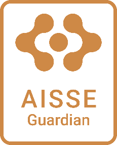
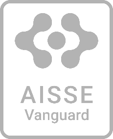

# AISSE Framework: Developer Handbook

Practical support in building beneficial AI

V0.43 16-Jul-25

## Introduction to the Framework

### Too long; didn't read?

Understanding the framework is the best way to leverage it for value, but if you're time poor and looking for help the AISSE Developer Companion AI can answer questions based on your project, and your current activities. Ask it for help.

### What This Is

The AISSE Framework helps you, the developer, build AI systems that benefit people by providing you with the tools and information you need to make sound design decisions. It\'s not about perfect ethics or endless processes, it\'s about being intentional and managing the things that matter. At its heart the framework is about providing you with clearer, less ambiguous information on the values and concerns that matter to users. It is:

- A template-driven framework for translating human values and preferences into AI development requirements at all levels
- A structured approach to considering risks and values across projects with increasing intelligence complexity
- A community-driven toolkit supporting developers to create AI that meets human expectations
- A mechanism for improving value alignment persistence as systems evolve beyond direct control
- A bridge connecting what we value to how we build AI systems

### Why Use This

**As a developer you get:**

- Clearer understanding of what your users and society actually care about
- Practical risk management that fits your project
- Optimised features that align to values, not just functionality
- Documentation that demonstrates that you\'ve thought things through
- A process that scales with your project size and where you choose the level of involvement

**Badging of your commitment**:

You will receive a badge that reflects your stated commitment level

<table style="width: 100%; border-collapse: collapse; background-color: transparent;">
  <tr>
    <td style="width: 25%; padding-left: 5px; padding-right: 5px; text-align: center; border: none; background-color: transparent;"></td>
    <td style="width: 25%; padding-left: 5px; padding-right: 5px; text-align: center; border: none; background-color: transparent;"></td>
    <td style="width: 25%; padding-left: 5px; padding-right: 5px; text-align: center; border: none; background-color: transparent;"></td>
    <td style="width: 25%; padding-left: 5px; padding-right: 5px; text-align: center; border: none; background-color: transparent;"></td>
  </tr>
</table>

Badging requires registration on the framework and fill-out of templates to provide information on your project. See Appendix A

**You reduce:**

- Building something people don\'t trust or want
- Nasty surprises after launch
- Reputation damage from preventable issues
- Generic AI Ethics statements that don\'t help shape the system

**Focus: Connect what your community values to what you actually build.**

## How the Framework is Organised

The AISSE Framework has been created to support developers across diverse projects. It's designed to help whether you are research cutting edge tech or implementing something more established, and whether the AISSE considerations are well-know or more emergent. It's also set-up to assist developers as their activities evolve from understanding a problem space, through design, implementation and testing. 

Let's examine this variation in projects the framework supports.

### From Concept to Operations

The resources and tools provided by the framework can assist you before you get to the stage of developing a production version of a tool. You can use the framework to assist with questions that are more loosely formed, through to seeking help identifying specific mitigations for projects that will be deployed. For example, during concept questions will focus on higher level ideas and expectations; by the time you're developing for production they'll be addressing specific values, risks, behaviours and configuration.

| **Concept(Research)   →   Prototype/Pilot   →   Release Development→   Operations** |
| ---------------------------------------------------------------------------------------------------------- |

Depending on the type of projects you're running, you might not be running certain stages. Perhaps you're using well researched tools and head straight to prototype, for instance. That's fine, the framework can help you address AI Safety and Ethics considerations however you are bringing your ideas to life.

The Framework is designed to minimise overheads, so as you take your concept to the point where it's ready for prototype, and then onto release version and operations, you can take the AISSE artefacts and improve them, rather than starting from scratch. For example, values and risks identified in concept phase can be carried forward to prototype.

### Alignment to your activities

Resources are identified according to familiar developer activities whether they are developing a concept, prototype or release version of the system. These activities are not a formal process or development flow you need to follow, you don't have to manage your project with these - use what works for you. When you want to use the toolkit you can check and find the right assistance by asking yourself *"What activity am I working on right now?"*

Figure 2: Developer Activities Supported by the AISSE Framework

But if you *would* prefer to have something guided, Appendix B presents a flow for projects who might be unfamiliar with applying AISSE during development. Projects are welcome to use this flow, but it is not a requirement.

Appendix C contains more details on the sorts of questions and challenges projects might have, depending on which stage they are at (research, prototype, pilot, production) and in operations.

### Support across all levels of AI-impact complexity

AI safety, security, and ethics impact categories vary dramatically in their epistemic status: how well we understand them and what approaches are needed. A bias detection algorithm (well-established) requires very different treatment than autonomous agent goal-setting (largely unknown territory).

To meet this diverse need the framework offers developers support for challenges they are facing across the spectrum of considerations. Resources are marked according to whether they are intended to help for the more certain or less well understood areas of AISSE. There are three tags in use:

**Established** - *We know what to do*
Domains where we have well-developed conceptual frameworks, broad consensus on principles, and proven methods for implementation. The knowledge base is mature with established best practices, precedents, and social agreements.

Unsettled - *We know the options but not which to choose*
Domains where multiple well-developed theoretical frameworks exist but there is no agreed approach to resolving the subject. We understand the concepts but lack consensus on which approaches to prioritise or how to resolve trade-offs between competing values.

Novel - *We don't yet know options, or maybe even the right questions*
Domains where we lack fundamental conceptual frameworks altogether. These are  uncharted challenges with little precedent, requiring new theoretical development and methodological innovation.

Most types of resource will have content or tools for each, but individual documents, tools, guides, etc. will often be labelled for only one or two to indicate their suitability. E.g. a bias removal tool for data might be labelled **Established.**

#### How is a impact's tag decided?

It's not a precise science, so if you feel that a risk or value-area is more or less well understood than suggested, you're free to treat it as you wish. Appendix D provides a discussion of how we judge the tag for a risk, value are, consideration, or implementation challenge 

This classification helps you:

- **Allocate appropriate resources** to different types of challenges
- **Choose suitable methodologies** for assessment and implementation
- **Identify when expert consultation** or research partnerships are needed
- **Avoid false confidence** in areas that require ongoing attention

The framework then provides **tailored guidance, tools, and resources** for each category, helping you address both risk mitigation and positive value creation appropriate to your specific development context.

### What kinds of topics are the focus of the AISSE Framework?

The AISSE Framework focuses on the challenges of implementing AI with attention to Safety, Security and Ethics. Tools and resources are dependent on community contribution, but the scoping for the framework is for resources on:

- Technical implementation of functionalities and mitigations to address AISSE in the development of agents
- Creation of environments that steer emergent intelligence towards positive outcomes (agentic and ASI, which we can't fully predict through design)
- Identifying values and risks relevant to a particular technology, project scope, stakeholder group or industry (What matters to humanity)
- Translating goals into a design to maximise positives aligned to identified values (what are the dangers?)
- Understanding how a system/component interacts within a larger architecture/supply-chain with respect to safety, security and/or ethics
- Practical questions on managing a particular stage/activity in development in a way that addresses AISSE and uses the framework.
- Understanding what is going on inside an in-life system or when something is changing (for better or worse)?

## Support Available 

The AISSE Framework has three key components that offer support and resources to developers, hosted on the AISSE platform.

### AISSE Developer Companion

A grounded AI chatbot that can assist you in exploring AISSE Values and addressing AISSE risks throughout the project. Assist provided:

- Guidance in navigating the AISSE Framework K/F/E
- Assistance in identifying relevant values, principles and associated risks particular to your project's footprint. K/F/E
- Guidance in setting risk thresholds and forming user stories to meet values goals\* K/F/E
- Support in running risk reviews and identifying mitigations\* K/F
- Assistance in identifying in-life monitoring and procedures\* K/F
- Exploration of best practice and emergent research relevant to your project using Qwello/Qwestor\* K/F/E

### AISSE Toolkit

The AISSE Toolkit contains knowledge, tools, guides, templates and other instant access resources you can use directly in your projects.

- Community Tools**:** Access reusable code, shared utilities, and tools to accelerate your development. K/F/E
- Value and Risk Profiles: Reusable learnings from previous, similar projects on what they identified as important in values and risk K/F/E
- Solution Pattern Documents: Leverage proven approaches and technical patterns for common AI risk mitigations and related technology challenges. K/F
- Best Practice Resources: Industry standards, responsible AI guidelines and research. K/F/E

### AISSE Community of Practice

Freelance services, expertise and input from a diverse and involved community to assist across the spectrum of challenges, provide feedback and advice, or to take on work packages for your project.

- **Community Expertise**: Request for input and expertise addressing challenges, either individual or as a deep-dives. (Seeding via academia?)

- **Community Service Offerings**: Community-offered services that can be used as advisory, testing, research and development-assistance (Seeding via academia?)

- **Stakeholder Representation:** Community members provide lived experience and local sector understanding, user-journey feedback, values and views.

### AISSE Platform

The AISSE Platform provides a single location for resources. The Platform is curated and governed by the SingularityNET AISSE Community of Practice\* who ensure the Framework is available, flexible and simple to use

The AISSE Platform also houses the AISSE Directory, an automated tool allowing developers to showcase their approach and efforts to address AISSE considerations. Developers can choose to sign-up their project and GitHub repository to feature in the AISSE directory and provide evidence to reputation system and ecosystem showcases\*

\* Functionality to be implemented

## Appendix A: Directory Progress Listing

This below grid provides details of the templates utilised by the directory system and which need to be present or updated for progress to be recorded. Note that the stage given in the project_description_template sets the stage for the whole project. If the stage in documents is set to a prior stage the shaded icon will indicate the activity was performed for a prior activity. 

<table>
  <tr>
    <td width="68" align="center" valign="middle"></td>
    <td width="20" align="center" valign="middle">→</td>
    <td valign="middle">
      Project is registered on the AISSE Directory. 
      Evidenced by: Filled <a href="https://github.com/TechInnocens/AISaE_Patterns/blob/main/aisse_project_documents/project_details.md">Project Details template</a> and registration
    </td>
  </tr>
  <tr>
    <td width="68" align="center" valign="middle"></td>
    <td width="20" align="center" valign="middle">→</td>
    <td valign="middle">
      Project has a researched list of relevant Values and Risks 
      Evidenced by: Entries in Impact Areas Identified and Risk Identified tables in <a href="https://github.com/TechInnocens/AISaE_Patterns/blob/main/aisse_project_documents/prioritisation_record.md">Prioritisation Record Template</a> (prioritisation not yet required)
    </td>
  </tr>
  <tr>
    <td width="68" align="center" valign="middle"></td>
    <td width="20" align="center" valign="middle">→</td>
    <td valign="middle">
      Project has prioritised their risks, agreed goals for values and set risk category thresholds 
      Evidenced by: Updated <a href="https://github.com/TechInnocens/AISaE_Patterns/blob/main/aisse_project_documents/prioritisation_record.md">Prioritisation Record Template</a> with prioritisation in Impact Areas Identified and Risk Identified tables, and AISSE Decision Section completed.
    </td>
  </tr>
  <tr>
    <td width="68" align="center" valign="middle"></td>
    <td width="20" align="center" valign="middle">→</td>
    <td valign="middle">
      Project has user stories/requirements for values-goals and has started risk reviews 
      Evidenced by: Filled <a href="https://github.com/TechInnocens/AISaE_Patterns/blob/main/aisse_project_documents/feature_development_plan.md">Feature Development Plan Template</a> and filled <a href="https://github.com/TechInnocens/AISaE_Patterns/blob/main/aisse_project_documents/risk_management_plan.md">Risk Management Plan Template</a>
    </td>
  </tr>
  <tr>
    <td width="68" align="center" valign="middle"></td>
    <td width="20" align="center" valign="middle">→</td>
    <td valign="middle">
      Project has completed testing with AISSE goals met and no outstanding red category risks 
      Evidenced by: No red category risks in Risk Management Plan Template; Implementation Status Complete/Dropped for all Impact areas being pursued
    </td>
  </tr>
  <tr>
    <td width="68" align="center" valign="middle"></td>
    <td width="20" align="center" valign="middle">→</td>
    <td valign="middle">
      Project has an in-life monitoring in place aligned to risks and values. 
      Evidenced by: Project in Operations stage; filled <a href="https://github.com/TechInnocens/AISaE_Patterns/blob/main/aisse_project_documents/in_life_monitoring_plan.md">In-Life Monitoring Plan Template</a>
    </td>
  </tr>
  <tr>
    <td width="68" height="50" align="center" valign="middle"></td>
    <td width="20" align="center" valign="middle"></td>
    <td valign="middle">
    </td>
  </tr>
  <tr>
    <td width="68" align="center" valign="middle"></td>
    <td width="20" align="center" valign="middle">→</td>
    <td valign="middle">
      Project has not yet provided this detail (for any stage)
    </td>
  </tr>
  <tr>
    <td width="68" align="center" valign="middle"></td>
    <td width="20" align="center" valign="middle">→</td>
    <td valign="middle">
      Project has provided details for previous stage
    </td>
  </tr>
  <tr>
    <td width="68" align="center" valign="middle"></td>
    <td width="20" align="center" valign="middle">→</td>
    <td valign="middle">
      Project has provided details for current stage
    </td>
  </tr>
</table>
 

## Appendix C: Sample questions for projects at different stages of development

## Appendix E: Tagging considerations based on epistemic status

How a value-area, principle or risk-area is tagged depends on where the handling (e.g. mitigating or avoiding risks, creating functionalities for values) is in terms of 4 dimensions. We (as a discipline within AI development) can ask ourselves:

- **Conceptual**: Do we have adequate theoretical frameworks and definitions?
- **Empirical**: Do we understand what actually happens or will actually happen?
- **Normative**: Do we know what we should want or value?
- **Technical**: Do we know how to build it reliably?

For each if these we can answer that things are Established, Unsettled or Novel in that area:
- **Established**: Well-developed frameworks, broad consensus, proven implementation methods (doesn't need to be perfect)
- **Unsettled**: Multiple competing approaches/schools, ongoing debates between valid perspectives
- **Novel**: Fundamental gaps in knowledge, challenges without precedent

Generally if we don't have unsettled or novel normative aspects we can't reliably say the technical are established. Likewise novel empirical insight suggests we can't be very certain on normative positions. And if we don't have a decent conceptual grasp we can't really say we're certain about much.

For example, consider question surrounding Human Autonomy. We have lots of technical implementations in place - we don't allow manipulation, we have consent forms, etc. But in reality:

- **Conceptual**: Unsettled - We understand the theory of human sovereignty, but it's not clear how it fits with other concepts
- **Empirical**: Novel/Unsettled - As a result and additionally, we don't have sufficient evidence to predict what 
- **Normative**: Novel/Unsettled - Without that predictive evidence, we can't decide what to optimise for
- **Technical**: Portrayed as Established, but on shaky ground.

