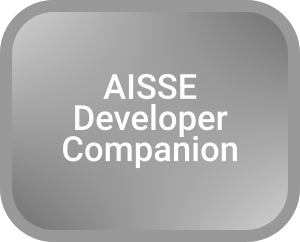
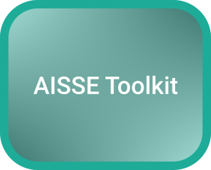
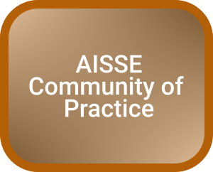
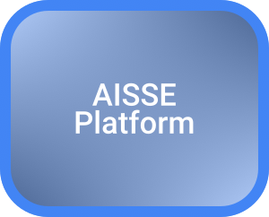

## What is the AISSE Framework?

* A template-driven framework for translating human values and preferences into AI development requirements at all levels
* A structured approach to considering risks and values across projects with increasing intelligence complexity
* A community-driven toolkit supporting developers to create AI that meets human expectations
* A mechanism for improving value alignment persistence as systems evolve beyond direct control
* A bridge connecting what we value to how we build AI systems

The framework is centered on giving developers access to information, assistance, tools, techniques and best-practice on AI Safety, Security and Ethics, relevant to *their project*

It consists of four major components

| &nbsp;                                                                           | &nbsp;                                                                                                                                                                                                                                                                                                                                                                                                                                                                                                                                |
| -------------------------------------------------------------------------------- | ------------------------------------------------------------------------------------------------------------------------------------------------------------------------------------------------------------------------------------------------------------------------------------------------------------------------------------------------------------------------------------------------------------------------------------------------------------------------------------------------------------------------------------- |
|    | The AISSE Developer Companion is a grounded AI helper that can assist developers during the entire development effort. Key tasks it can help with: - Identifying relevant values, principles and risks - Running sessions on AISSE (e.g. Human-in-the-Loop checks, risk reviews) - Translating areas where you want to focus on AISSE into user stories - Scoring risks - Creating evals and tests                                                                                                                     |
|    | The AISSE Toolkit is a set of tools, guides, community assistance, services and other information developers can use when they hit a roadblock in understanding of implementing AISSE for their projects.   It includes two libraries that give insight into what previous projects with similar profiles to the developers' did: - risk, principles and values profiles: what did these projects focus on? - mitigation and solution patterns: how did they address these?                                          |
|  | The Community of Practice plays a dual role. Firstly they provide their experience, skills, expertise and insights into the framework by curating information, offering services, tools and techniques.  They also govern the Framework, ensuring it meets the needs of developers and other community members as technological and social drivers shift.                                                                                                                                                                             |
|   | The AISSE platform enables the whole Framework. It is a GitHub hosted repository, enabling decentralised governance and contribution. From the GitHub backend, it can be  It also contains the logic and code to run the voluntary-membership AISSE Project Directory. By signing-up and using the markdown templates provided, developers can showcase their efforts and receive a badge representing their intent. The use of this decentralised approach allows other platforms and reputation systems to use the framework.    |

